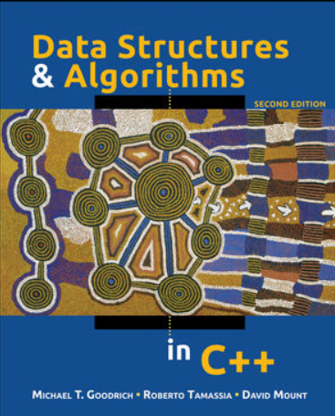

# 1장 C++

**BOOK : C++로 구현하는 자료구조와 알고리즘**



## 목차

[[toc]]

## 함수스타일 형변환
- 함수 형태: double(i1)
- 일반 형태: (double) i1 

## 인라인 함수
- 함수 호출-반환 대신 단순한 코드 확장을 지시

::: tip 장점 과 단점

장점 : 성능 향상 (매우 짧은 경우)   
단점 : 반복 호출 시 메모리 소모 큼

:::   

## 클래스 프랜드

- 출력을 해야하는 경우 Ostream은 클래스의 private 변수에 접근하지 못하지만 friend 함수 선언 시 접근 가능 하다   
```cpp
friend ostream& operator<<(ostream& out, const SomeClass& x)
```
## 배열과 Vector의 범위 검사
- 배열과 Vector 둘 다 색인([])접근이 가능하나 vector만 원소의 범위를 확인 할 수 있다.

## 헤더 가드 (Header guard)
- 조건부 컴파일 지시자 사용 [[참고]](https://boycoding.tistory.com/144)
  * #ifndef, #define, #endif   

::: warning

동일 함수가 중복으로 include 되지 않게 함

:::   


***
_**Date 2020-08-05**_
***

